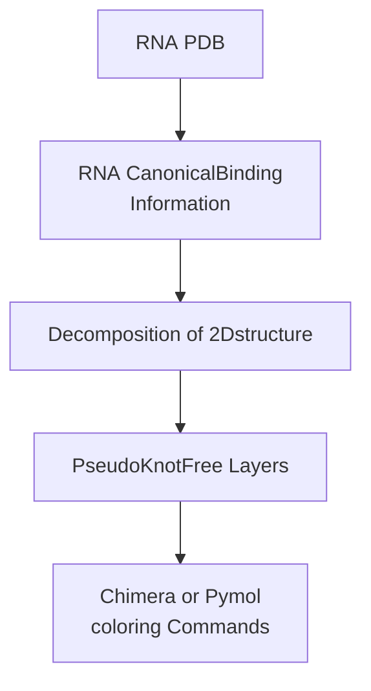

# RNA PseudoKnot Extractor 
RNA PseudoKnot Extractor (rPKExtractor) can extract the pseudoknots from 3D structure.


## overview



## installation

Dependency:
- rnaview
  - https://github.com/rcsb/RNAView
- rna-tools
  - https://github.com/mmagnus/rna-tools

For now, rnaview does not work in MacOS, it follows that you cannot use rPKExtractor in MacOS.


After rnaview and rna-tools installed,
```sh
git clone https://github.com/TakumiOtagaki/RNApseudoknotExtractor.git
cd RNApseudoknotExtractor
pip install -r requirements.txt
```

## usage
Simple.

```
cd RNApseudoknotExtractor
# ./pkextractor.sh PDB_ID chimera_or_pyMOL
# ./pkextractor.sh 1KPD chimera
```
Then you can see that `RNApseudoknotExtractor/coloring/${viewer}_${PDB_ID}.txt` is generated.
This text file has the coloring script of the viewer you selected (chimera or pyMOL).


