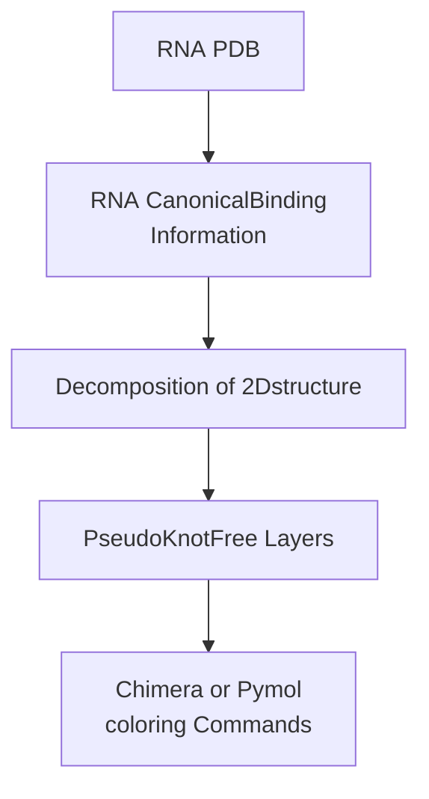

# RNA PseudoKnot Extractor 
RNA PseudoKnot Extractor (rPKExtractor) can extract the pseudoknots from 3D structure.


## overview



## installation

Dependency:
- rnaview
  - https://github.com/rcsb/RNAView
- rna-tools
  - https://github.com/mmagnus/rna-tools

For now, rnaview does not work in MacOS, it follows that you cannot use rPKExtractor in MacOS.


After rnaview and rna-tools installed,
```
git clone 
```
